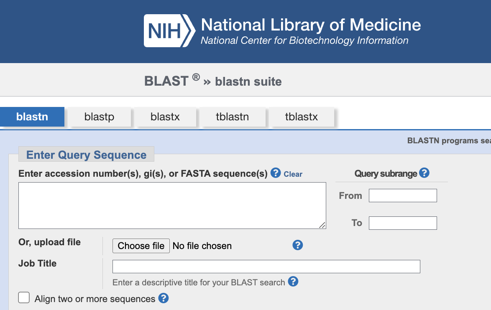
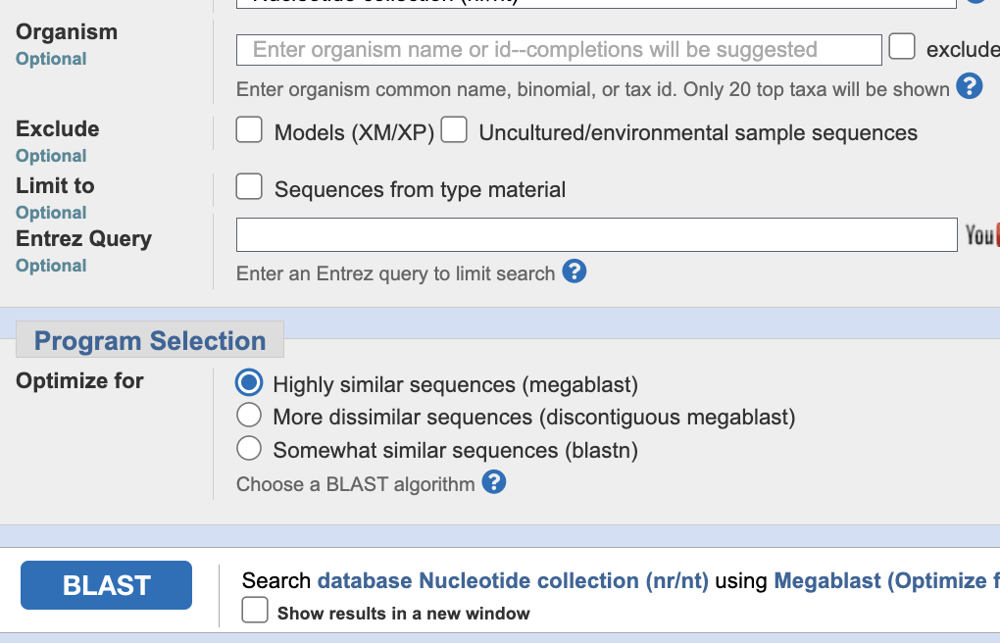
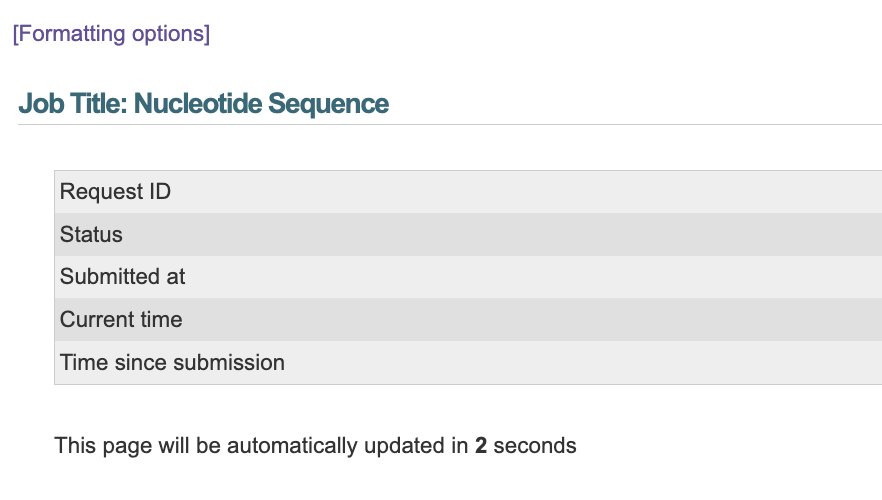
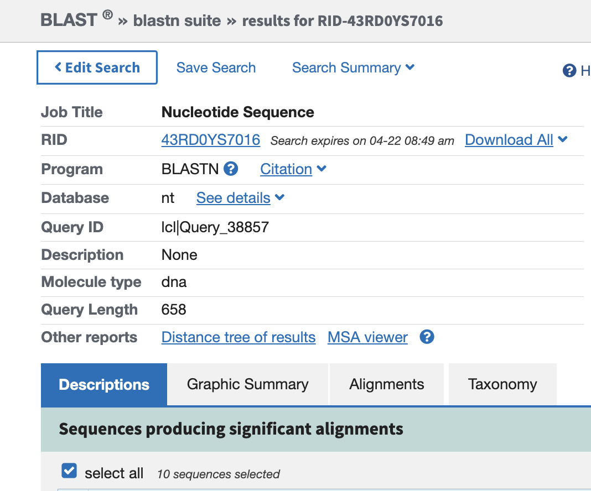
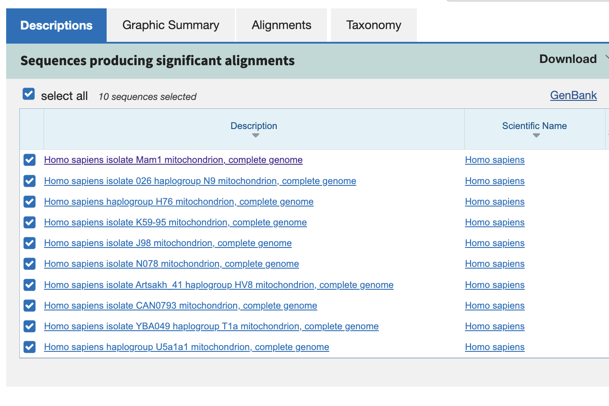
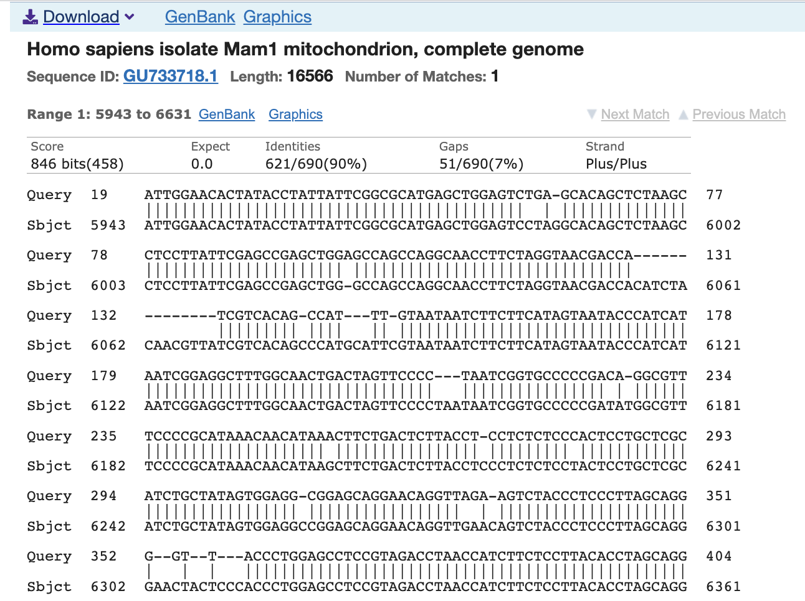
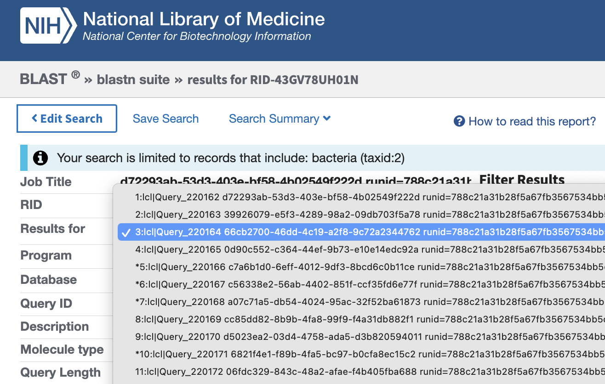
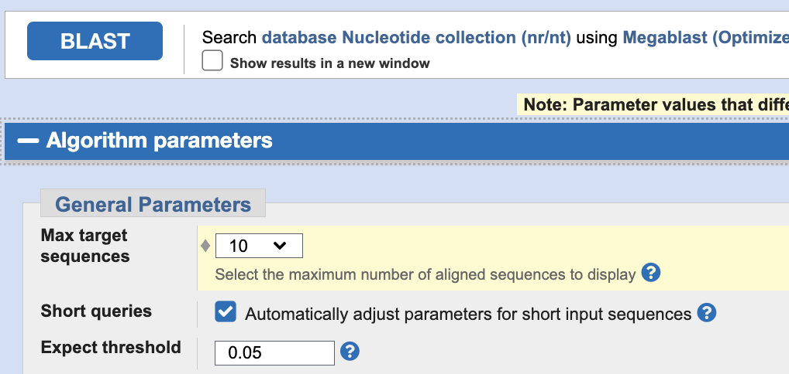
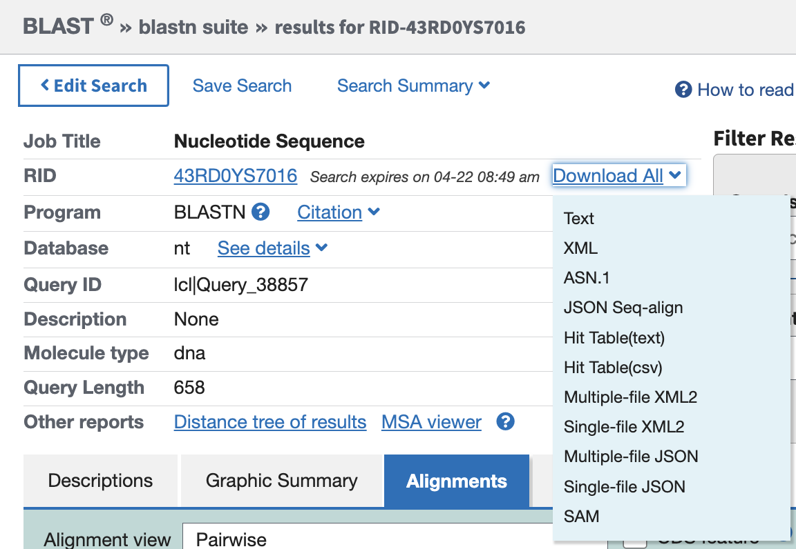

In Week 4 you will get an introduction to Oxford Nanopore seqeuncing, the output data, and sequence file formats.

Let's first remind ourselves why we are performing this experiment, what the goals are, and what the possible outcomes are.

It is possible to approach this lab in a reverse manner - by seeing what you will have to do and then reading the relevant background to understand it. If this is the approach you would like to take, then scroll to the bottom, **Your Assignment**.

# Using mtDNA COI Regions to Identify Species

## Introduction:

DNA sequencing has revolutionized the field of taxonomy and species identification. One of the most widely used genetic markers for species identification is the mitochondrial DNA (mtDNA) cytochrome c oxidase subunit I (COI) region. COI is a protein-coding gene located in the mitochondrial genome, which is maternally inherited and is highly conserved across most animal species. The COI gene has a high mutation rate and contains a substantial amount of variation, making it an ideal marker for species identification. In recent years, the advent of new technologies, such as Oxford Nanopore Technologies (ONT) sequencing, has enabled faster and more accurate species identification using COI data.

## Using mtDNA COI Regions to Identify Species:

The mtDNA COI region is used to identify species by comparing the nucleotide sequences of the COI gene from different individuals or populations. By comparing the sequences, researchers can identify the degree of similarity or difference between the sequences and assign them to specific species. The degree of difference between the sequences can be used to determine whether the sequences belong to the same or different species.

In addition to species identification, the COI gene can also be used to infer the evolutionary relationships between species. By constructing a phylogenetic tree based on COI sequences, researchers can determine the evolutionary history of different species and the degree of relatedness between them.

## Using ONT Data to Identify Species:

ONT sequencing is a third-generation sequencing technology that allows for the direct sequencing of DNA without the need for PCR amplification or library preparation. This technology provides longer read lengths and higher accuracy than previous sequencing technologies, making it ideal for species identification using the COI gene.

To use ONT data for species identification, researchers first isolate DNA from the target species and sequence the mtDNA COI region using ONT sequencing. The resulting reads are then filtered, trimmed, and assembled to generate a consensus sequence for each individual. The consensus sequences are compared to a reference database of COI sequences from known species using a variety of bioinformatics tools and software.

Several bioinformatics tools are available for COI sequence analysis, including BLAST, BOLD, and MEGA. These tools allow researchers to compare the COI sequences obtained from ONT data to a reference database of COI sequences and identify the closest match to the target species. In some cases, the COI sequence obtained from ONT data may not match any sequence in the reference database, indicating the presence of a new or unknown species.

## Summary of mtDNA COI:

The mtDNA COI region is a powerful genetic marker for species identification and phylogenetic analysis. The use of ONT sequencing technology has further enhanced the accuracy and speed of species identification using the COI gene. With continued advancements in sequencing technology and bioinformatics tools, the use of COI data for species identification and evolutionary analysis is expected to become increasingly widespread in the future.

Now we can finally begin our data analysis.

You will all have a different data set to analyse. Please click [here]() to obtain your dataset. Each dataset will be labelled with your full name. Go ahead and click on the link to download the data.

The method that you will use to analyse your data is called BLAST.

# Introduction to Oxford Nanopore Sequencing

Oxford Nanopore sequencing is a next generation sequencing technology that allows for rapid DNA sequencing using a handheld device. It was developed by Oxford Nanopore Technologies, a UK-based company that was founded in 2005.

## How it Works

The basic principle behind Oxford Nanopore sequencing is that a single strand of DNA is passed through a tiny nanopore in a membrane. A current is run through this membrane, and  tiny changes in electrical signals produced by the movement of the DNA through the pore are recorded. The pore essentially acts as a molecular sensor of DNA charge.

As this DNA molecule passes through the pore, the different bases (A, T, C, and G (or methylated bases, or even U in the case of RNA)) produce unique electrical signals that can be used to reconstruct the original sequence of the DNA.

The way that these signals are decoded into the order of base pairs depends on powerful computational methods. Currently, these are machine learning methods based on recurrent neural networks with [long short term memories](https://en.wikipedia.org/wiki/Long_short-term_memory "LSTM"). Oxford Nanopore's website [has more details](https://nanoporetech.com/how-it-works/basecalling "Guppy and more")

## Advantages

One of the main advantages of Oxford Nanopore sequencing is its portability. The handheld device can be used outside of the lab, making it ideal for applications such as disease surveillance and environmental monitoring.

Another advantage is the long read lengths that can be achieved. Traditional sequencing methods (e.g. [Sanger](https://en.wikipedia.org/wiki/Sanger_sequencing "The OG") or [Illumina](https://en.wikipedia.org/wiki/Illumina_dye_sequencing "The OG NGS")) typically generate short reads of a few hundred bases, whereas Oxford Nanopore sequencing can generate reads that are tens of thousands of bases long or even millions of base pairs long. This allows for more complete genome assembly and better detection of structural variants (changes in the structure of chromosomes, such as duplications of chromosomal regions or inversions of specific regions).

## Applications

Oxford Nanopore sequencing has a wide range of applications, including:

- Whole genome sequencing
- Metagenomics
- Transcriptomics
- Epigenetics
- Pathogen detection (e.g. [COVID-19](https://oxfordnanoporedx.com/covid-19 "I did this"))
- Forensics

The data output from Oxford Nanopore sequencers is a string of nucleotides, e.g. `ATGCGTGGGTCTTTAG` except these strings are usually thousands or hundereds of thousands of nucleotides long. However, the data also contain two other pieces of important information. The first is a unique name for the sequence, and the second is the "quality" of the sequence - i.e. how sure we can be that the sequencer has reported the correct nucleotide. This format (sequence name, nucleotide sequence, and nucleotide accuracy) is called `fastq` format.

## Your Nanopore data
We took your PCR samples (after the second PCR step) and _ligated_ on adapters and "motor" proteins that are required for sequencing. We then sequenced all the samples from the class on a single _previously used_ Oxford Nanopore MinION R9.4.1 flowcell. We then basecalled the data (i.e. transformed the recorded electrical signals into basepairs) using Guppy. More precisely:
1. We used a ligation library prep method called [LSK-109](https://interpriseusa.com/product/ligation-sequencing-kit/ "adjacent website")
2. We sequenced on a MinION R9.4.1 flowcell with a [MinION Mk1B device](https://nanoporetech.com/products/minion?gad=1&gclid=EAIaIQobChMIxuuL38q8_gIV79dMAh1zSA3LEAAYASABEgI_n_D_BwE#tabs-0=mk1b "Tiny")
3. We basecalled using [Guppy](https://nanoporetech.com/how-it-works/basecalling "guppy again") v6.1
4. From this, we got DNA sequence data in FASTQ format.

# Introduction to FASTQ format

The FASTQ format is a widely used file format for storing DNA sequence and quality score data. It is commonly used for output from high-throughput sequencing instruments such as Illumina, PacBio, or Oxford Nanopore.

## Why is FASTQ format useful?

FASTQ format is useful because it combines both the DNA sequence and its corresponding quality score (accuracy) information into a single file. This makes it easier to store and analyze sequencing data, as opposed to storing these two pieces of information separately, or storing solely the DNA sequence.

## How should I interpret FASTQ format?

Each entry in a FASTQ file contains four lines of information:

1. **Header line**: starts with '@' character followed by a unique identifier (i.e. "name") for the sequence read.
2. **Sequence line**: contains the actual DNA sequence read in the form of a string of A, T, C, and G nucleotides.
3. **Separator line**: starts with the '+' character and is optionally followed by the same identifier as the header line.
4. **Quality score line**: contains quality scores for each base in the sequence read. These scores represent the confidence in the accuracy of the base call, with higher scores indicating higher confidence.

Here's an example of what a single entry in a FASTQ file might look like:

```bash
@SEQ_ID
GATTTGGGGTTCAAAGCAGTATCGATCAAATAGTAAATCCATTTGTTCAACTCACAGTTT
+
!''((((+))%%%++)(%%%%).1*-+*''))**55CCF>>>>>>CCCCCCC65
```


In this example, the header line starts with the '@' character and the sequence line contains the DNA sequence. The separator line (which serves no real purpose) has a `+` character. Finally, the quality score line contains quality scores for each base in the sequence read.

You will note that the quality score line contains letters, numbers, and symbols, and not only numbers. I noted above that this line specifies the _accuracy_ of each base pair. You might thus expect these to be numbers, for example between `0` and `1`, which `1` indicating it's 100% certain that this is the correct nucleotide, and `0` indicating that it is 0% certain. This is actually what this line is indicating, b ut it is doing so in a slightly cryptic manner.

Rather than encoding the numbers simply as numbers, they are encoded as "compressed" numbers by using `ASCII` characters. All [`ASCII` characters](https://en.wikipedia.org/wiki/ASCII "maybe you've seen ASCII art?") are either control characters or "printable" characters, and it is this second set that you are seeing. These are associated with the numbers [33 to 128](https://theasciicode.com.ar/ "some tables"). For example, `!` the exclamation point is associated with the number 33, and upper case f `F` is associated with the number 70.

So above, the first few quality (accuracy) scores are `!` (33) `'` (39) `'` (39) `(` (40) `(` (40) `(` (40) `(` (40) `+` (43) `)` (41) `)` (41) `%` (37) ...etc.

## How should I interpret quality scores?

Wait! you say. Those aren't numbers between 0 and 1! That is true. Instead, they are numbers between 33 and 128. To transform these into quality scores (i.e. accuracy), we first subtract 33, so that the lowest character-associated number (`!` or 33) begins at `0`. _Then_ we transform these numbers into a number between `0` and `1` with a log transformation. We don't need to discuss this transformation equation here. Suffice to say that the smaller the number, the lower the accuracy. If the number is 10 (`+`) then the _accuracy_ is 90% - we can be 90% certain that the DNA sequencer has told us the correct nucleotide. If the number is 20 (`5`) then we can be 99% sure it is the correct nucleotide. If it is 30 (`?`) we can be 99.9% sure. If it is 40 (`I`) we cann be 99.99% sure. If it is 50 (`S`) then we can be 99.999% sure etc. etc.

_Usually_ with Oxford Nanopore sequence, we will be about 97% sure that the sequencer has given us the correct nucleotide. This might sound good, but frequently we will need higher accuracy, for example if we want to figure out if a genome has a specific mutation. In _our_ case though (where we want to figure out which species at mtDNA COI sequence is from), 99% accuracy will often be fine. And in many cases, Oxford Nanopore sequence will be 99.9% accurate (yay!).    

## Summary of fastq

The FASTQ format is an essential file format in bioinformatics, and understanding how to interpret it is critical for analyzing sequencing data. By combining DNA sequence and quality score information into a single file, FASTQ makes it easier to store, transmit, and analyze sequencing data, enabling researchers to gain new insights into the genetic makeup of organisms.


# Introduction to FASTA format

FASTQ format contains information on the nucloetide sequence and the quality (accuracy) of the sequence. However, there is also a second standard format that nucleotide sequences are stored in. This is FASTA format. It contains _only_ nucleotide sequence data and no quality data. Each entry in a fasta file consists of two lines: the _name_ of the sequence, which is _always_ preceded by a ">", and the seequence itself. For example:

```bash
>SEQ_ID
GATTTGGGGTTCAAAGCAGTATCGATCAAATAGTAAATCCATTTGTTCAACTCACAGTTT
```

You can see this is simpler than FASTQ. Since (for now) we are only interested in the sequences and not in the quality, in this lab you will only encounter (and use) FASTA sequence data.


## How can we begin to analyse this sequence data?

Given the enormous amount of sequence data produced by next generation sequencing methods such as Oxford Nanopore (billions of base pairs of DNA sequence), it would be impossible to analyse these DNA sequences “by hand.” For this reason, powerful computational approaches have been developed that allow billions (or even trillions) of base pairs of DNA to be analysed very quickly.

We will apply these methods to analyse our own DNA sequence data, with the aim of answering a simple question: what is in this DNA sample?

We note, at first, that [Computers can save you time](https://twitter.com/OdedRechavi/status/1629765548564267008?s=20 "I have no idea if this is a real scene")

# Introduction to BLAST

BLAST, which stands for Basic Local Alignment Search Tool, is a widely used bioinformatics program that compares a query sequence with a database of known sequences to find matches. BLAST is a powerful tool for identifying similarities between sequences, and it is particularly useful for identifying related sequences in large databases. 

The basic idea behind BLAST is to take a query sequence, break it down into small segments, and compare each segment to a database of sequences. The program then returns a list of matches, ranked by their degree of similarity to the query sequence.

One of the main advantages of BLAST is its speed. Because it breaks the query sequence into small segments, it can perform many comparisons in parallel, allowing it to search large databases quickly. Additionally, BLAST has a range of features and parameters that allow users to customize the search to their specific needs.

To use BLAST, you first need to obtain a query sequence that you want to compare to a database. This sequence can be in a variety of formats, including FASTA, GenBank, or EMBL. You then need to select a database to search. BLAST supports a wide range of databases, including the NCBI nucleotide and protein databases, the Swiss-Prot protein database, and many others.

Once you have your query sequence and database selected, you can use the BLAST program to search for matches. BLAST can be accessed through a web interface, such as the NCBI BLAST website, or through standalone software that can be downloaded and run on your own computer. 

To perform a search, you simply input your query sequence and select the appropriate database and search parameters. BLAST then returns a list of matches, ranked by their degree of similarity to the query sequence. From this list, you can select individual matches to examine in more detail, or you can download the entire set of matches for further analysis.

## Summary of BLAST
BLAST is a powerful bioinformatics tool that can be used to search for similarities between sequences. Its speed and flexibility make it an essential tool for many types of biological research, from genome sequencing to protein structure prediction. By breaking down sequences into small segments and comparing them to a database of known sequences, BLAST provides a quick and accurate way to identify related sequences and uncover new insights into biological systems.


# Using BLAST
The BLAST website is freely available and is primarily run from servers that sit in the US. You can find the website [here](https://blast.ncbi.nlm.nih.gov/Blast.cgi "blast off"). Note that there are several "flavours" of BLAST - two of the most commonly used are "blastn" and "blastp", which allow you to search for databases sequences matching Nucleotide sequnces (blastN) or Protein sequences (blastP). In you case, you have nucleotide sequences, so we will be using [blastn](https://blast.ncbi.nlm.nih.gov/Blast.cgi?PAGE=MegaBlast&PROGRAM=blastn&PAGE_TYPE=BlastSearch&BLAST_SPEC= "nucs only"). Open a tab of that page now.


<br>
**This is what the page should look like** <br><br>


On this page you can see an empty white box. This is where you will paste your nucleotide sequence(s) of interest, usually in FASTA format.

## Your sample data

The sequences from your samples are available for download as a zip file via [this link](data/203210-nanopore-sequences.zip). If that does not work, they are also available on the Stream website, in the Lab tab. Please download those now and uncompress the .zip file (this may occur automatically, or you may need to double click it).

Once you have done that, you will see a folder with a number of files that are labeled by barcode (`barcode01.filter.fasta`, etc.) Each of these contains a filtered set of seequences from each of the barcodes that you used. Some of you may not see your barcode. In this case, we may not have generated any sequence from your sample because of an error somehwere along the way, or because it was just too difficult to get DNA from your sample. **Do not worry if this is the case**. If you cannot see your own barcode, then for the report you will have to select another set of data to analyse.

Here is a quick summary of the data that we did get:<br>

|file                  |number of seqs|total length|min. length|average length|max. length|
|:---------------------|:-----|:---|:-------|:------|:------|:------|:------|
|barcode01|  2       |1023   |506    |511.5  |517    |
|barcode02|  11      |7514   |509    |683.1  |778    |
|barcode07|  4       |2512   |598    |628.0  |677    |
|barcode10|  12      |7171   |507    |597.6  |744    |
|barcode11|  2       |1289   |609    |644.5  |680    |
|barcode13|  2       |1272   |526    |636.0  |746    |
|barcode14|  116     |68392  |500    |589.6  |772    |
|barcode15|  579     |406318 |504    |701.8  |798    |
|barcode17|  4       |2357   |519    |589.3  |751    |
|barcode18|  1       |590    |590    |590.0  |590    |
|barcode19|  17      |9872   |501    |580.7  |748    |
|barcode20|  71      |40141  |501    |565.4  |800    |
|barcode28|  16      |9684   |500    |605.3  |755    |

<br><br>As you can see, some barcodes sequenced more successfully than others. More specifically, barcodes 14 and 15 were very successful, with 116 and 579 total sequences each. Note that even these numbers are quite small (but that is not your fault). We have limited our expenses for this experiment and so have not sequenced extensively. In a normal sequencing experiment we would usually generate more than 50 million sequences.

There are several other pieces of data in the table above beside the number of sequences. You can also see the total length of all the sequences added together, and the minimum, maximum, and average length. Note that the reason these all are named "filter" is that I have filtered out all sequences less than 500 bp in length, as we expect that - minimally - our PCR products from the COI region should be 650 bp or so (this will not always be exact due to deletions or breaks in the sequences that can occur).

Once you have determined whether there is data in your sample (by finding the file that corresponds to your sample's barcode), go ahead and open the file by double clicking. You are likely to get a complaint from your computer that it does not know what program to use. In this case, you can try Word or a similar program, but much better would be to use a simple text editor, such as _Notepad_ or _TextEdit_ or _Atom_.

Once you have opened this file, you should see some sequence(s) in FASTA format. Remember this format: it is the name of the sequence, preceded by a ">", with the DNA sequence itself on the following line. For example, something like this:

```bash
>39333e46-41fa-4385-98df-5c4d63cf61bc runid=788c21a31b28f5a67fb3567534bb5cc52215f048 sampleid=2023-04-03_OS_PCR_samples read=1133 ch=8 start_time=2023-04-03T05:28:36Z model_version_id=2021-05-17_dna_r9.4.1_minion_768_2f1c8637 barcode=barcode28
GTTCTACAAGTATAAAATATTGGAACACTATACCTATTATTCGGCGCATGAGCTGGAGTCTGAGCACAGCTCTAAGCCTCCTTATTCGAGCCGAGCTGGAGCCAGCCAGGCAACCTTCTAGGTAACGACCATCGTCACAGCCATTTGTAATAATCTTCTTCATAGTAATACCCATCATAATCGGAGGCTTTGGCAACTGACTAGTTCCCCTAATCGGTGCCCCCGACAGGCGTTTCCCCGCATAAACAACATAAACTTCTGACTCTTACCTCCTCTCTCCCACTCCTGCTCGCATCTGCTATAGTGGAGGCGGAGCAGGAACAGGTTAGAAGTCTACCCTCCCTTAGCAGGGGTTACCCTGGAGCCTCCGTAGACCTAACCATCTTCTCCTTACACCTAGCAGGTGTCTCCTCTATCTTAGGGGCCATCAACCATCACAACAATTATCAATATAAAACCCCCTGCCATAACCCAATACCAAACGCCCCTCTTCGTCTGATCCGTCCTAATCTAGTCCTACTTCTCCTATCTCTCCCAGTCCTAGCTGCTGGCGCCACTATACTACTAACAGACCGCAACCTCAACACCACCTTCGGCCCGCCGGAGGAGGGGCGTCTATACCAGCACTATTCTGATTTTTCGGACACCCAGAAGTTTA
```

The name here is quite long as it contains many different pieces of information including:
1. A unique identifier for the sequence _39333e46-41fa-4385-98df-5c4d63cf61bc_
2. A unique identifier for the sequencing run _788c21a31b28f5a67fb3567534bb5cc52215f048_
3. A unique identifier for the sample _2023-04-03_OS_PCR_samples_
4. The number of the read _1133_
5. The channel of the read _8_
6. The start time of the read _April 03 5:28am GMT_
7. The sequencing platform _DNA R9.4.1 MinION_
8. The barcode _28_

First, go ahead and copy that sequence above (you may have to scroll to get all of it) and paste it into the white textbox on the BLASTN webpage. once you have done that, scroll down and press the _BLAST_ button.<br>


<br>
**This is the BLAST button**<br><br>

You will then see a page that looks like this:<br>

<br>
**This is the time to twiddle your thumbs**<br><br>

After that, you should see another screen load, this will look like this:<br>

<br>
**First results!**<br><br>

This page has a list of the sequences in the database that match the sequence you pasted in above. Go ahead and scroll down a bit. You should see a list of "Descriptions":<br>


<br>
**Hmmm...**<br><br>

Finally, click on the top link (or one close to the top). This will bring you to an alignemnt of your sequence (the one you pasted into the white box on the previous page) and the top-matching sequence in the BLAST database (the default you used is the "nr", or non-redundant nucloetide database which currently contains 92,292,742 sequences and thousands or even millions times that in terms of total base pairs). This alignment should look something like this:<br>

<br>
**lots of letters**<br><br>

Let's go through this from the top. First, you will see that the title notes this your sequence matches the _Homo sapiens_ mitochondrial genome. Yay! This is what we expected. Below that, you will see the sequence ID, length, and number of matches. We can ignore those for now. Below that, you can see three important quantities:
1. **Expect**
2. **Identities** (and alignment length)
3. **Gaps**

Let's go through those in detail.

## Expect

This number specifies the number of sequences in the database that you would _expect_ to match as well (or better) as your sequence matches _if the database were made of random nucleotides_ (and was the smae size). Here, we can see that you would expect to find zero (0.0) sequences that match as well as this human mitochondrial sequence. In other words, **this is a very good match**. Other Expect-values you might see (also denoted as [E-values](https://www.metagenomics.wiki/tools/blast/evalue "explain e")) that would indicate a good match could be _1e-20_ - in other words, you would expect to find a sequence match as good in only _1e20_ searches, aka if you search _1 x 10^20_ times, only one of those times would expect to find a match this good. Or you might find _1e-10_ - this would also be good. **The smaller the E-value the better**. On the other hand, an E-value of 10 menas that _even in a database of random nucleotides_ you would expect find 10 sequences that match just as well. In other words, the match is no better than random.


## Identities

This specifies how many nucleotides in the database sequence _exactly_ match your sequence once the two sequences have been aligned. You can see this in the aignment itself, in whcih was **Identity** is indicated by a vertical line between two nucleotides. As you might expect, more identities (and higher fractions of identities indicates a better match).

## Alignment Length
An important aspect of the sequence match is whether it matches over the whole (or almost) length of your sequence. Sequences that match only oart of yours shoudl be viewed with skepticism - after all, we expect that if your sequence is from a mtDNA region, this region will be in the database _in full_. You can check the length by noting the second number in the **Identities** score (e.g. 600/620 means 600 identities out of an alignment 600 bp in length). In this case, longer alignments are better.

## Gaps

This indicates how many gaps are present in the alignment of the two sequences. These are regions in which insertions or deletions have occurred - either because your sequence is from an organism that doesn't exactly match the one in the database, or because your sequence itself has errors.

# Your Assignment

You will need to take the sequences that you have in your sequence file (from your barcode) and figure out what organisms those sequences come from. **If your barcode is not in the results file, or if you have very very few sequences** then you can use sequences from a different barcode.

To do this, you should use BLAST (although you are also free to use other methods). Note that you **must** take into account whether your sequence matches well (hint: check the e-value); whether the matched **organismS** makes sense (hint: can you come up with reasonable explanations); and if you don't have an obvious explanation, _what a possible explanation is_. IMPORTANT: your sequences should / will match different kinds of organisms. This is because the mtDNA COI primers should amplify DNA from _any_ eukaryotic organism in your sample. _In addition_ you may see DNA that is not from eukaryotic organisms - this is very likely to be contaminant, either from your own sample, or from other sources, for example [the kits used to isolate DNA](https://onlinelibrary.wiley.com/doi/full/10.1111/1755-0998.13485?casa_token=CT7SF3lpEvAAAAAA%3A7_CDq7KEdqrF6b_M9Q6ponkexhQwoebAYMTSnhKjGiU1wxbOH6H1yzhmPRRPlTiovufx2s2FP3yw "be carefu!")

## Your Report
These sequence-matching results will make up the bulk of the restuls section of your report. The **Methods** consist of how you got these DNA sequences (including the Nanopore sequencing; see above for how that happened). The **Results** consist of the matches for your reads, as well as how good those matches are, how well they align, etc. If there are no good matches (true for some of you), you need to report this, show that there are no good matches, and detail how you tried to ensure you could find good matches. The **Discussion** consists of a discussion as to whether your results make sense, and why or why not they make sense.


## Hints and Tips

It is possible to BLAST multiple sequences at once (in fact I **highly** recommend you do this). To do this, simply highlight and copy multiple sequences from your sequence file (not more than 100). Then, paste these into the white box on the blastn homepage. press the BLAST button, and you will - eventually - be brought to the results page. Here, you will see an extra tab under **Results for**. You can click this and see all of the hits for each of the sequences you have entered. Note that any hit with an asterisk next to it had **no signficiant hits in the database at all**.<br>


<br>
**If you submit many sequences at once, you should be able to click this tab and select any one that you want.**<br><br>

It is also possible to adjust the parameters for your blast result. This can be done on the first blastn page below the BLAST button:


<br>
**Here you can things like the number of results reported.**<br><br>

Finally, you can download all your results at once so you can sort them or look through them more easily, for example in Excel. For example, you might want to sort your results so that **you only consider matches with low e-values _and_ long alignments**. To do this, click on the _Download all_ link. I recommend downloading them as a text file of the hits. You can then open them in Excel. _Unfortunately_, this will just tell you which reads have good matches (e.g. where "good" means they have low e-values and long alignments). This table will _not_ tell you what organism the match is to - you will have to return to the blast page to do that, or search up that specific sequence in your sequence file and re-BLAST it.


<br>
**Use this button to download your results**<br><br>

## Help and Assistance

If you need any help or have any questions on the analysis - _any at all_ - please let me know. This is likely to be your first introduction to sequence analysis via BLAST.

